# GreenMart 🥕

A simple Flutter application with introductory screens for a grocery shopping app.  

## 📱 Screens Overview  

### Row 1  
| Splash Screen | Welcome Screen |  
|---------------|----------------|  
| 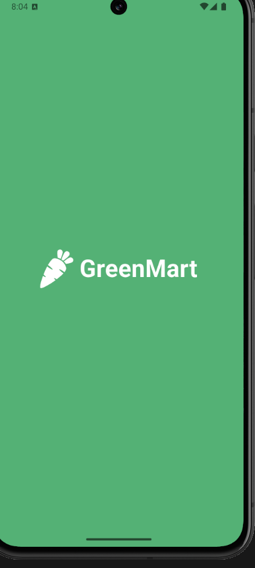 |  |  

### Row 2  
| Login Screen | Signup Screen |  
|--------------|---------------|  
| 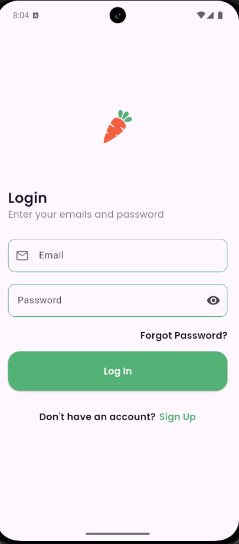 | 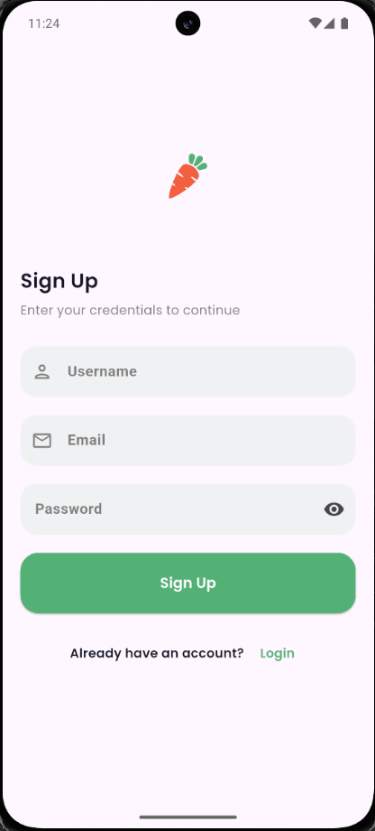 |  

### Row 3  
| Mobile Number Screen | Verification Screen |  
|----------------------|----------------------|  
| 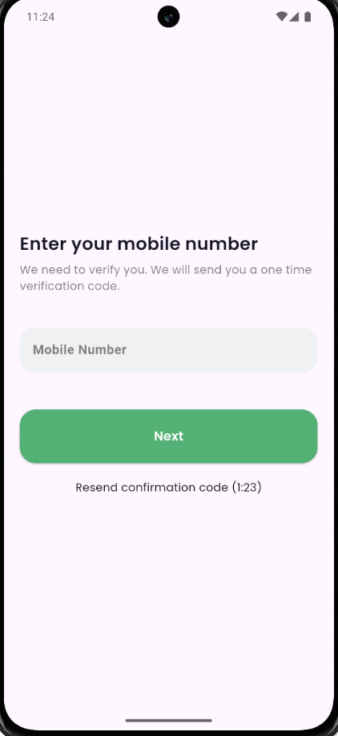 | 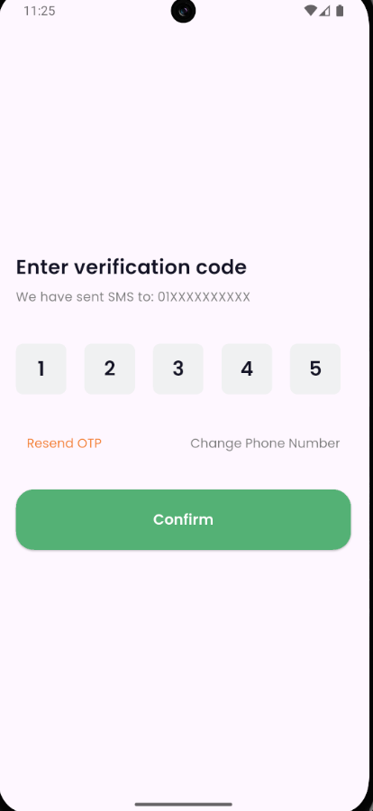 |  

### Row 4  
| Store Screen | Explore Screen |  
|--------------|----------------|  
| 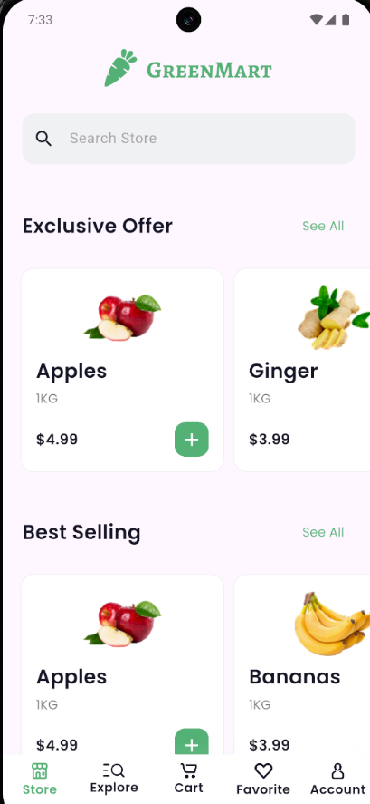 | 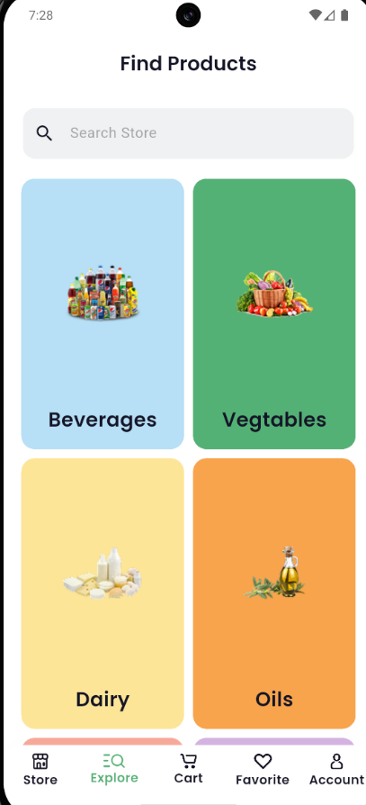 |  

### Row 5  
| Product Details 1 | Product Details 2 |  
|------------------|-------------------|  
| 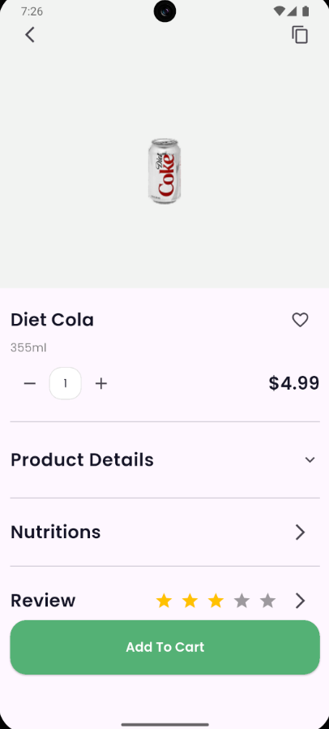 | 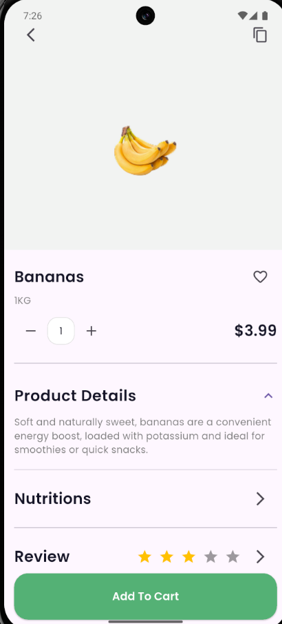 |  

### Row 6  
| Section Screen | Favorites Screen |  
|----------------|------------------|  
| 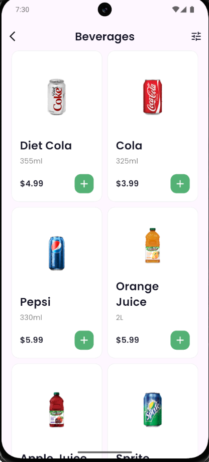 | 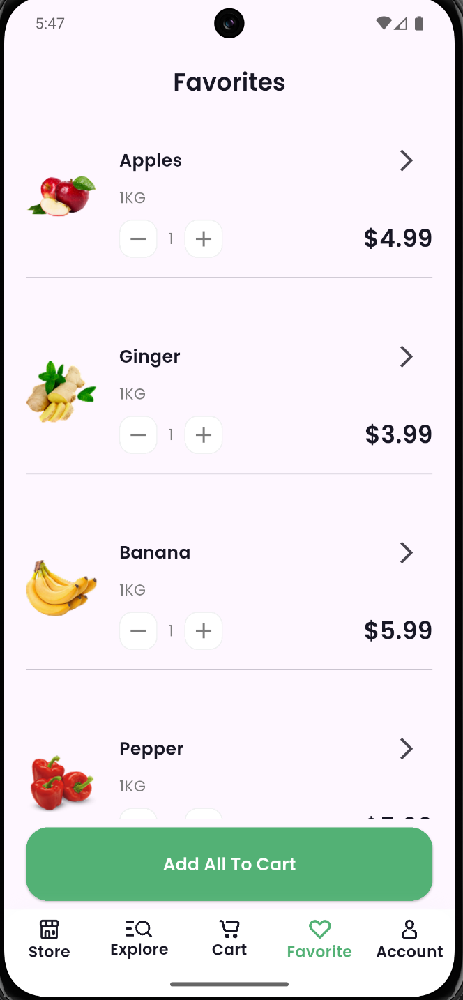 |  

### Row 7  
| Search Screen | Profile Screen |  
|---------------|----------------|  
| 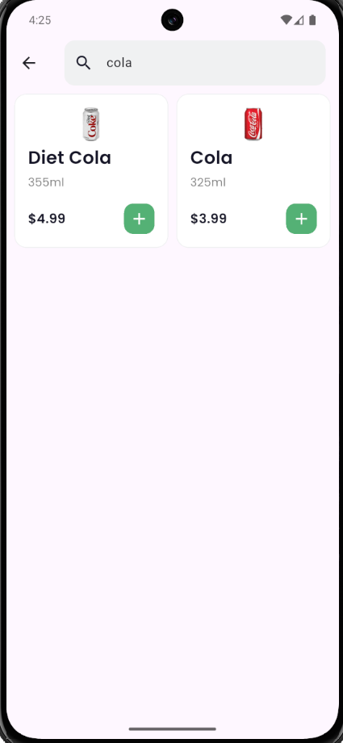 | 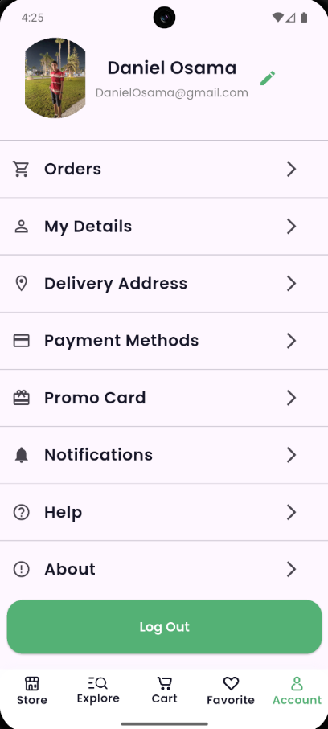 |  

### Row 8  
| Cart Screen | Sheet Screen |  
|-------------|--------------|  
| 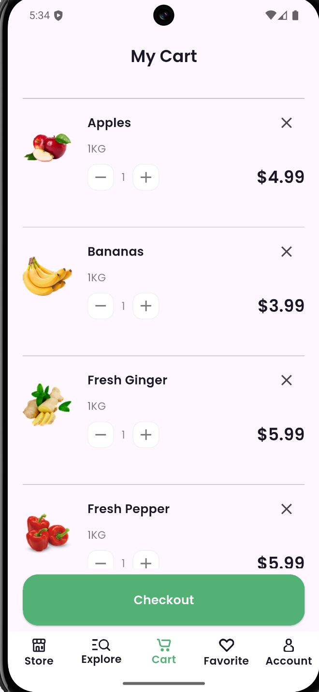 | 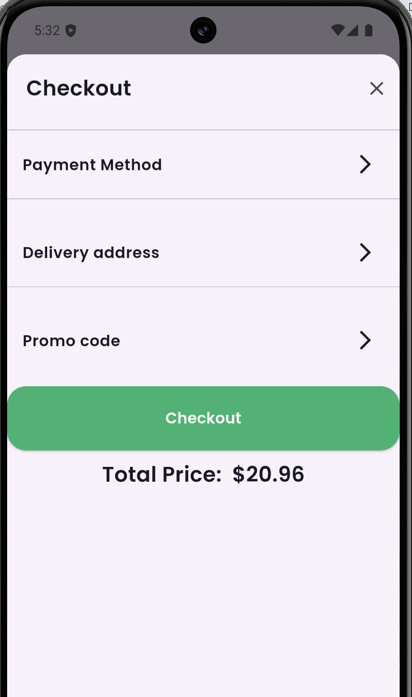 |  

### Row 9  
| Accepted Screen |  
|-----------------|  
| 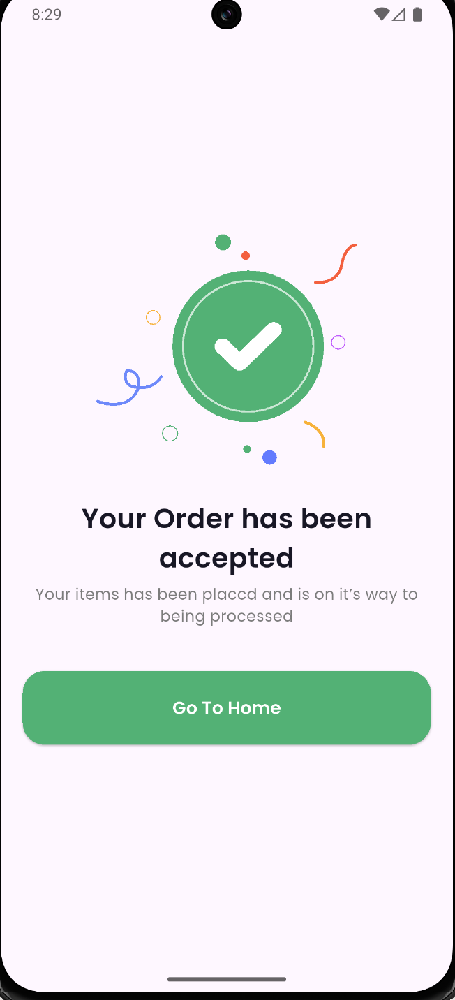 |  

---

## 🚀 Features  
- **Splash Screen**: Displays app logo and transitions to Welcome.  
- **Welcome Screen**: Intro message with "Get Started" button.  
- **Login Screen**: Email & password form with navigation to Signup.  
- **Signup Screen**: User registration form with navigation back to Login.  
- **Mobile Number Screen**: Collects user’s phone number for verification.  
- **Verification Screen**: OTP input with resend and change-number options.  
- **Store Screen**: Search bar, offers, and best products displayed.  
- **Explore Tab**: Now working — lets you access sections of different products.  
- **Section Screen**: Displays products relevant to the chosen category.  
- **Favorites Screen**: Save and view your favorite products.  
- **Search Screen**: Quickly find products across categories.  
- **Profile Screen**: Manage user information and settings.  
- **Cart Screen**: View and manage items before checkout.  
- **Sheet Screen**: Bottom sheet for quick actions or product previews.  
- **Product Details Screen**: Clicking on a product shows more detailed information.  
- **Accepted Screen**: Confirmation screen for successful actions/orders.  

---

## 📥 Clone the Repository  
To get started, clone the repo directly:  

```bash
git clone https://github.com/your-username/GreenMart.git
