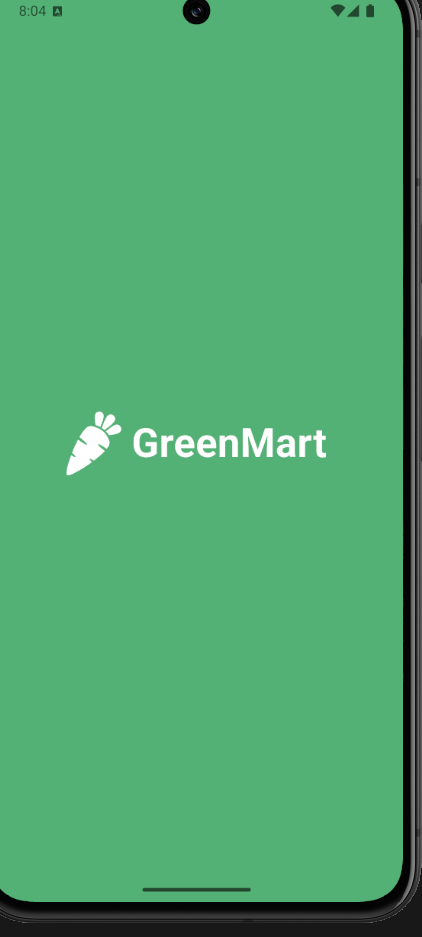
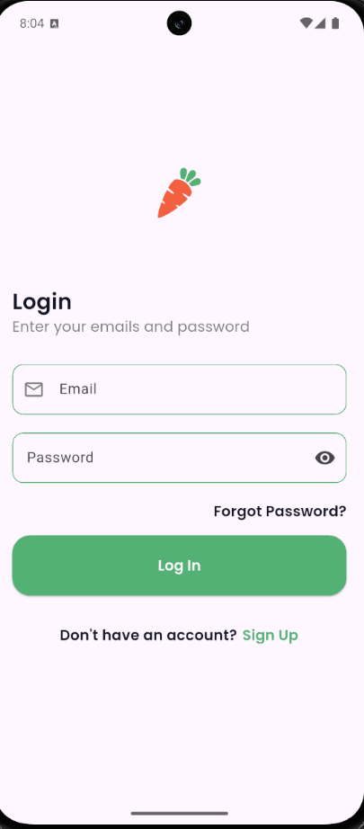
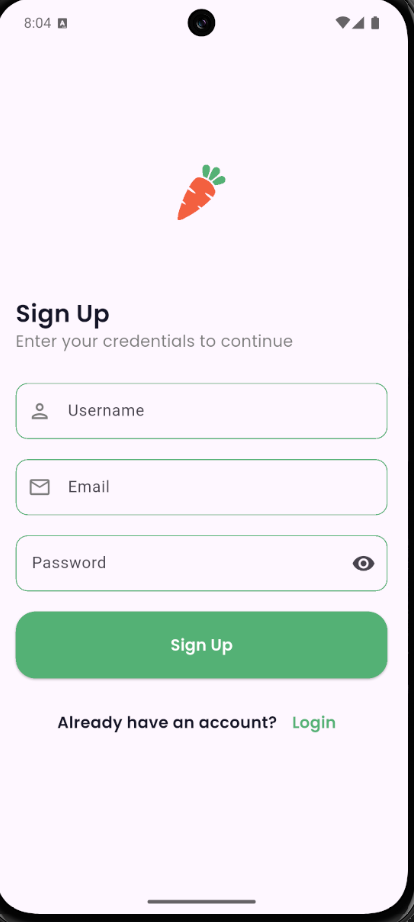
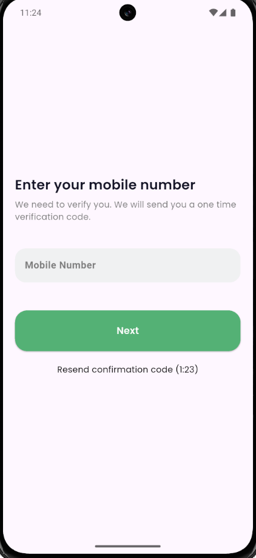
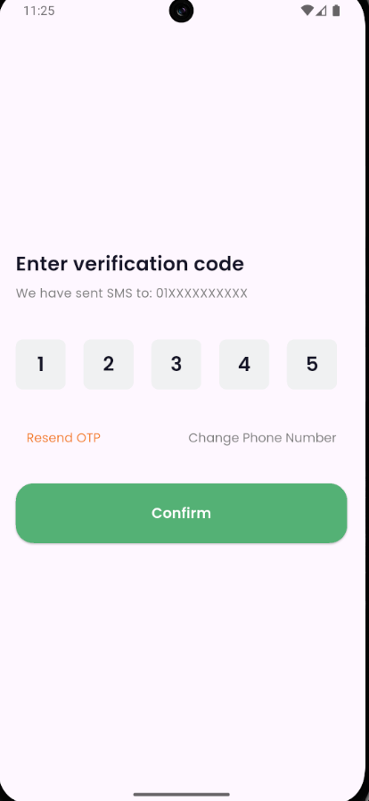
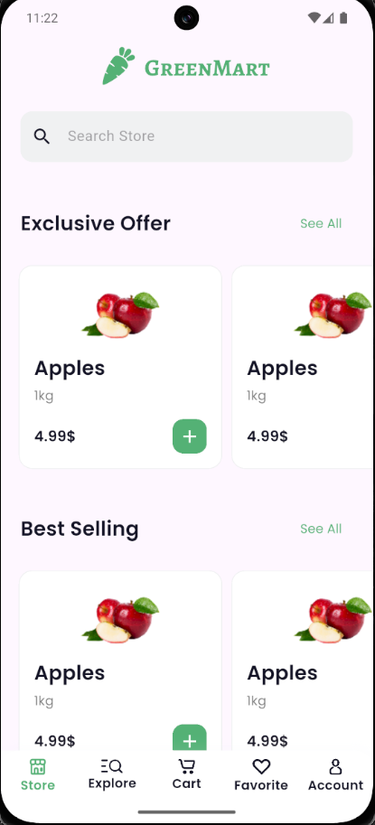

# GreenMart 🥕  

A simple Flutter application with introductory screens for a grocery shopping app.  

## 📱 Screens Overview  

### Row 1  
| Splash Screen | Welcome Screen |  
|---------------|----------------|  
|  |  |  

### Row 2  
| Login Screen | Signup Screen |  
|--------------|---------------|  
|  |  |  

### Row 3  
| Mobile Number Screen | Verification Screen |  
|----------------------|----------------------|  
|  |  |  

### Row 4  
| Store Screen |  
|--------------|  
|  |  

---

## 🚀 Features  
- **Splash Screen**: Displays app logo and transitions to Welcome.  
- **Welcome Screen**: Intro message with "Get Started" button.  
- **Login Screen**: Email & password form with navigation to Signup.  
- **Signup Screen**: User registration form with navigation back to Login.  
- **Mobile Number Screen**: Collects user’s phone number for verification.  
- **Verification Screen**: OTP input with resend and change-number options.  
- **Store Screen**: Search bar, offers, and best products displayed.  
